# COGS 137 Project - The Makings of a Great Scooby-Doo Show

## Introduction

For any current or ex-child, the phrase “Saturday Morning Cartoons” most
definitely releases a feeling of excitement when heard. After a long
week of slaving through the monotonous trenches of school, nothing beats
a Saturday morning in front of the television with a bowl of sugary
cereal. For generations, television providers have cashed in on this
block of time to allow the creation of animated entertainment control
the attention of its youth demographic.

On the topic of animation, the continuous output of new cartoons can be
recognized as a way of keeping the audience entertained and stationed to
their favorite channel. Nevertheless, some cartoons have transcended the
short lived cycle to continue their cultural influence in present day.

Scooby-Doo is a children’s mystery series developed by the Hanna-Barbera
animation studios in the late 1960s [^1]. The show follows a group of
kids and their dog, with a speech impediment, as they work together to
solve mysteries most commonly orchestrated by old people in monster
suits. In its over 50 year run, the series has amassed 16 unique
television series and over 100 movies [^2].

You would imagine that with a ginormous catalog such as Scooby-Doo, it
would be impossible to stay invested with every single movie and episode
that is offered. Nevertheless, not all heroes wear capes. In assistance
with the online Scooby-Doo based encyclopedia, user @plummye completed
the entire library of Scooby-Doo that was availabe. In addition,
@plummye blessed the internet with a data set of documented variables
commonly found in the franchise [^3].

Provided with this dataset, our team examined which variables contribute
to the IMDB rating. The variables examined in our case study included
the network that produced the show, audience engagement in the form of
number of IMDB ratings, the format (television episode or movie),
monster type, amount of monsters, which character caught the monster,
the terrain of the setting, motive, number of times popular character
phrases were said, and who the voice actors were for each character.

## Question

Which combination of predictor variables in a linear model best predicts
the IMDB score for a given Scooby Doo episode/movie?

### Load packages

``` r
library(tidytuesdayR)
library(tidyverse)
library(tidymodels)
library(broom)
```

### Import Data

``` r
tuesdata <- tt_load(2021, week = 29)
scoobydoo <- tuesdata$scoobydoo
```

### Wrangle Data

After looking at the initial dataframe, a lot of the variables can be
seen in types of structures and formats that are not optimal for
analysis. For our wrangling we changed our variable types to types we
could analyze (some sort of numeric/logical value compared to
characters). Since there were also some niche crossover and special
episodes/series within the dataset that had a different plot-style than
normal Scooby Doo episodes/movies, we decided to remove those as well
because they would interfere with the analysis of the normal Scooby Doo
episodes/movies. We accomplished this by filtering for series names that
only contained “Scooby” or “Warner”, and took out special cases where a
series had less than three episodes.

``` r
# wrangle data
scoobydoo <- scoobydoo |>
  filter(grepl("Scooby", series_name) | grepl("Warner", series_name)) |>
  filter(series_name != "Scooby Goes Hollywood",
         series_name != "The Scooby_Doo Project")

# Most popular phrases
phrases = c("imdb", "engagement", "number_of_snacks", "split_up", "another_mystery", "set_a_trap", "jeepers", "jinkies", "my_glasses", "just_about_wrapped_up", "zoinks", "groovy", "scooby_doo_where_are_you", "rooby_rooby_roo")
scoobydoo[,phrases] <- apply(scoobydoo[,phrases], 2, function(x) as.numeric(x))

people_catch = c("monster_real", 'caught_fred', 'caught_daphnie', 'caught_velma', 'caught_shaggy', 'caught_scooby', "captured_fred", "captured_daphnie", "captured_velma", "captured_shaggy", "captured_scooby", "unmask_fred", "unmask_daphnie", "unmask_velma", "unmask_shaggy", "unmask_scooby", "snack_fred", "snack_daphnie", "snack_velma", "snack_shaggy", "snack_scooby", "trap_work_first", "non_suspect", "arrested")
scoobydoo[,people_catch] <- apply(scoobydoo[,people_catch], 2, function(x) as.logical(x))

amount_monsters = c("monster_amount")
scoobydoo[,amount_monsters] <- apply(scoobydoo[,amount_monsters], 2, function(x) as.character(x))

voice_actors = c("fred_va", "daphnie_va", "velma_va", "shaggy_va", "scooby_va")
scoobydoo[,voice_actors] <- apply(scoobydoo[,voice_actors], 2, function(x) as.character(x))

# create and add monster_catcher column to scoobydoo df
scoobydoo <- 
  scoobydoo |>
  mutate(monster_catcher = case_when(
    caught_daphnie == TRUE & caught_fred == FALSE & caught_scooby ==  FALSE & caught_shaggy ==  FALSE & caught_velma == FALSE & caught_other == FALSE & caught_not == FALSE ~ "Daphnie",
    caught_daphnie == FALSE & caught_fred ==  TRUE & caught_scooby == FALSE & caught_shaggy ==  FALSE & caught_velma == FALSE & caught_other == FALSE & caught_not == FALSE ~ "Fred",
    caught_daphnie == FALSE & caught_fred == FALSE  & caught_scooby ==  TRUE & caught_shaggy == FALSE & caught_velma == FALSE & caught_other == FALSE & caught_not == FALSE ~ "Scooby",
    caught_daphnie == FALSE & caught_fred == FALSE & caught_scooby == FALSE & caught_shaggy == TRUE & caught_velma == FALSE & caught_other == FALSE & caught_not == FALSE ~ "Shaggy",
    caught_daphnie == FALSE & caught_fred == FALSE & caught_scooby == FALSE & caught_shaggy == FALSE & caught_velma ==  TRUE & caught_other ==  FALSE & caught_not == FALSE ~ "Velma",
    caught_daphnie == FALSE & caught_fred == FALSE  & caught_scooby ==  FALSE & caught_shaggy ==  FALSE & caught_velma == FALSE & caught_other == TRUE & caught_not ==  FALSE ~ "other character",
    caught_daphnie == FALSE & caught_fred == FALSE  & caught_scooby ==  FALSE & caught_shaggy == FALSE  & caught_velma ==  FALSE & caught_other == FALSE  & caught_not == TRUE ~ "monster not caught",
    TRUE ~ "multiple characters"))
```

## Analysis

### Exploratory Data Analysis

##### Network

Now let’s observe how many Scooby Doo shows each network produced to get
a sense for how invested each network was in its Scooby Doo shows.

``` r
scoobydoo |>
  group_by(network) |>
  count() |>
  ggplot(aes(x = n,
             y = fct_reorder(network, n),
             fill = network)) +
  geom_col() +
  guides(fill = "none") +
  labs(
    title = "Total Number of Scooby Doo Shows Produced",
    subtitle = "ABC a clear winner in number of shows",
    x = "Number of Shows Produced"
  ) +
  theme_bw() +
  theme(plot.title.position = "plot",
        axis.title.y = element_blank())
```

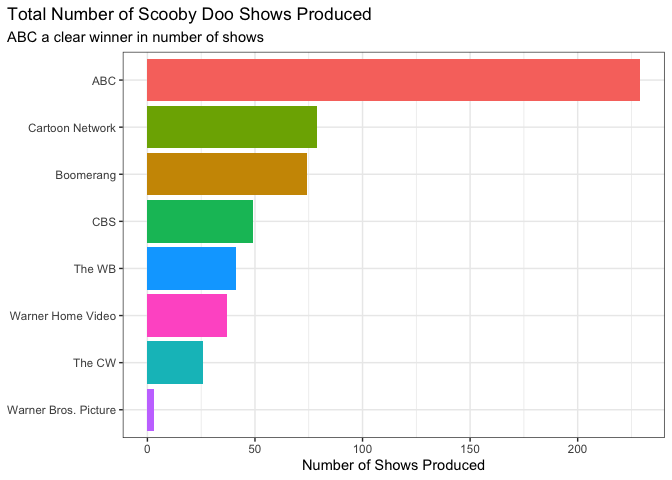<!-- -->

Looking at the number of shows that each network produced, ABC has the
most shows, while Warner Bros. Picture has the least.

##### Engagement Affecting IMDB

Looking at the data, we can see that the number of people that engage
with the IMDB website varies per show, and we want to visualize how the
number of people that engage could possibly effect the IMDB score. To
visualize this, we first filter engagement to be under 10,000 to get rid
of the few outliers that would skew the visualization, and use ggplot()
and geom_point() to create a scatter plot of the IMDB score compared to
engagement numbers.

``` r
scoobydoo |>
  filter(engagement < 10000) |>
  ggplot(aes(x = engagement,
         y = imdb)) +
  geom_point() +
  labs(
    title = "IMDB score vs. Engagement Levels",
    subtitle = "IMDB scores skew towards 6-7 as engagement levels increase",
    x = "Number of People Engaged on IMDB Website",
    y = "IMDB Score"
  ) +
  theme_bw() +
  theme(plot.title.position = "plot")
```

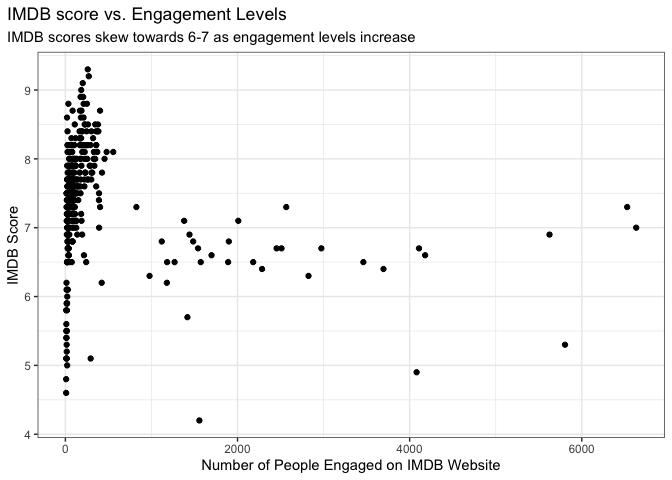<!-- -->

Looking at the data, we see that the shows that received a low amount of
engagement had much more variable IMDB scores, which is to be expected
since there is a smaller population size and more room for variability.
We also saw that when engagement increased, the typical IMDB score was
somewhere between 6 and 7, showing that the average score fell within
this range when an episode or movie had a high level of engagement on
the IMDB website.

##### Scooby Doo Show Format

Format represents how an instance of the Scooby-Doo show presented to
the audience (i.e. televeision episode or movie). Understanding the
format of show that the network produced could provide insight into the
influence of the show’s format on IMDB score. We checked the count by:

1)  group_by() the dataset by the series format.

2)  count() the number of unique formats

3)  plot a barplot.

``` r
scoobydoo |>
  group_by(format) |>
  count() |>
   mutate(format = na_if(format, "NULL")) |>
  drop_na() |>
  ggplot(aes(x = n, y = fct_reorder(format, n), fill = format)) +
  geom_col() +
  guides(fill = "none") +
  labs(title = "Format Types in Scooby-Doo Franchise",
       x = "Number of Times Format is Used", y = "Format Type") +
  theme(plot.title.position = "plot")
```

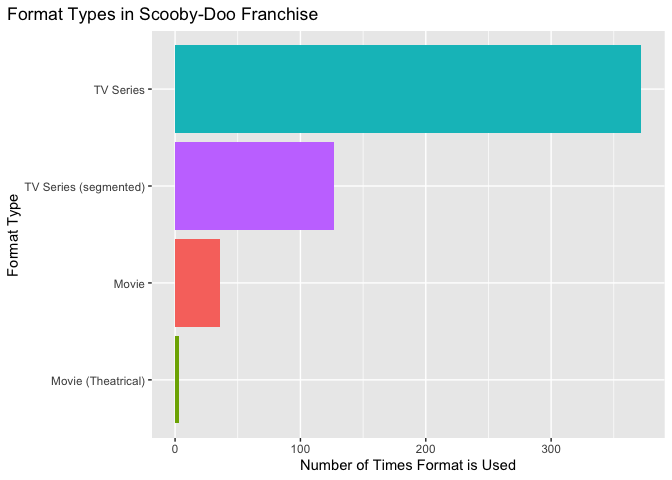<!-- -->

Scooby Doo was intended to be a television series which makes sense why
its TV count is over 300 which is far more than the number of movies.
Movies were seen as more exclusive and took longer to produce which is
why there were not as many.

##### Monster Type

In every episode of Scooby-Doo, the main characters consisting of Fred,
Daphnie, Velma, Shaggy, and Scooby AKA Scooby Doo (collectively
self-referred to as “the gang”) have the intention of solving a mystery.
While in the process of solving the mystery the gang is usually
interrupted by a monster or a villain dressed up as a monster.

Let’s see what monster type the gang encounters the most. We did this
by:

1)  group_by() the scoobydoo data set by monster_type

2)  count() the number of times a certain monster type appeared.

3)  mutate() a new column which checked for NULL values and dropped NA
    values.

4)  filter out any counted monster types that were equal to or less than
    11 so we could get the top 10 types.

5)  plot which types were counted the most.

``` r
# Determine most common monster type
scoobydoo |>
  group_by(monster_type) |>
  count() |>
  mutate(monster_type = na_if(monster_type, "NULL")) |>
  drop_na() |>
  filter(n >= 11) |> # reduce dataset to top 10 monster_types
  ggplot(aes(x = n, y = fct_reorder(monster_type, n), fill = monster_type)) +
  geom_col() +
  guides(fill = "none") +
  labs(title = "Common Monster Types in Scooby-Doo ",
       x = "Number of Episodes Monster Type Appears In", y = "Monster Type") +
  theme(plot.title.position = "plot")
```

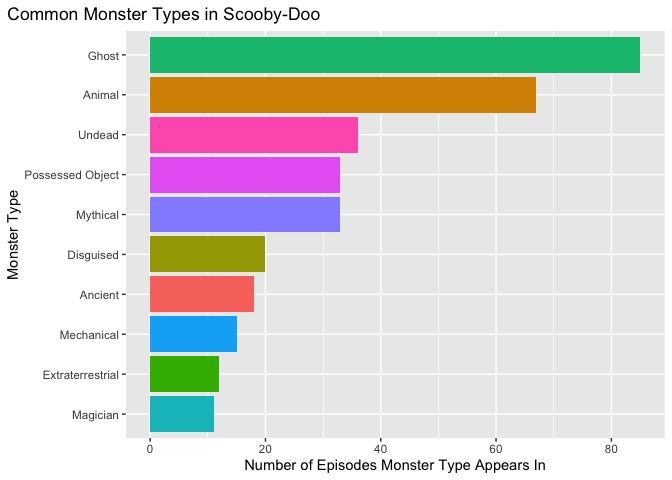<!-- -->

Note that episodes that have multiple monsters are categorized
separately. For example, an episode with two ghosts would not count
toward the “ghost” total but instead count toward the “ghost,ghost”
total.

Based on this plot, it shows that ghosts were the most common monster
type. Note that a ghost is a pretty vague type as different people,
animals, monsters, etc. can be displayed as having ghost like qualities.

##### Amount of Monsters

Now let’s look at how many monsters appear in episodes/movies.

``` r
scoobydoo |>
  group_by(monster_amount) |>
  count() |>
  ggplot(aes(x = n, y = fct_reorder(monster_amount, n), fill = monster_amount)) +
  geom_col() +
  guides(fill = "none") +
  labs(title = "Number of Monsters Found in an Episode/ Movie",
       x = "Number of Times a Number of Monsters Identified", y = "Number of Monsters") +
  theme(plot.title.position = "plot")
```

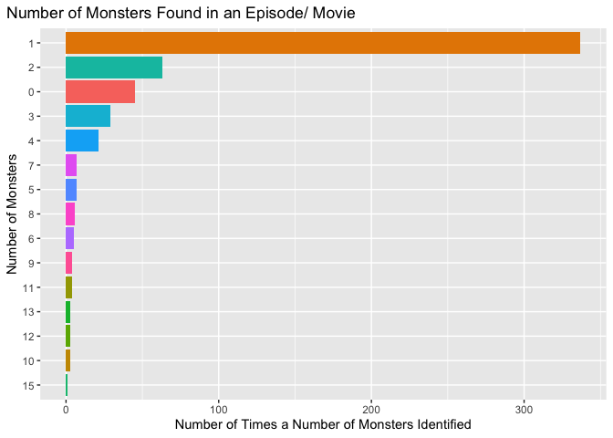<!-- -->

Based on the plot above, we can see that the vast majority of episodes
only feature one monster.

##### Terrain of Setting

The setting of an episode of Scooby Doo was always interesting to find
out. With new places around the world also came different types of
people that the gang would interact with. We checked this by:

1)  group_by() the dataset by the setting/ terrain variable

2)  count() the number of unique settings

3)  plot a barplot.

``` r
scoobydoo |>
  group_by(setting_terrain) |>
  count() |>
  mutate(setting_terrain = na_if(setting_terrain, "NULL")) |>
  drop_na() |>
  ggplot(aes(x = n, y = fct_reorder(setting_terrain, n), fill = setting_terrain)) +
  geom_col() +
  guides(fill = "none") +
  labs(title = "Number of Different Settings Where Show Takes Place",
       x = "Number", y = "Setting/ Terrain") +
  theme(plot.title.position = "plot")
```

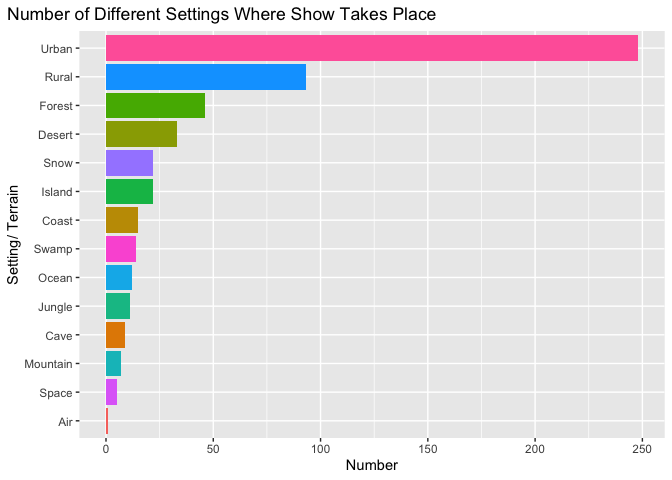<!-- -->

Based on the barplot, urban is the most common setting. All of these
settings are vague which could mean that the gang did a lot of their
investigations in places with larger groups of people (being in more of
a city setting).

##### Motive

Another variable we checked was the motive behind the crimes committed
by the villains in the show. We did this by:

1)  group_by() the dataset by the motive

2)  count() the number of unique motives

3)  plot a barplot.

``` r
scoobydoo |>
  group_by(motive) |>
  count() |>
  mutate(motive = na_if(motive, "NULL")) |>
  drop_na() |>
  ggplot(aes(x = n, y = fct_reorder(motive, n), fill = motive)) +
  geom_col() +
  guides(fill = "none") +
  labs(title = "Count of Types of Villian Motives",
       x = "Number", y = "Crime Motive") +
  theme(plot.title.position = "plot")
```

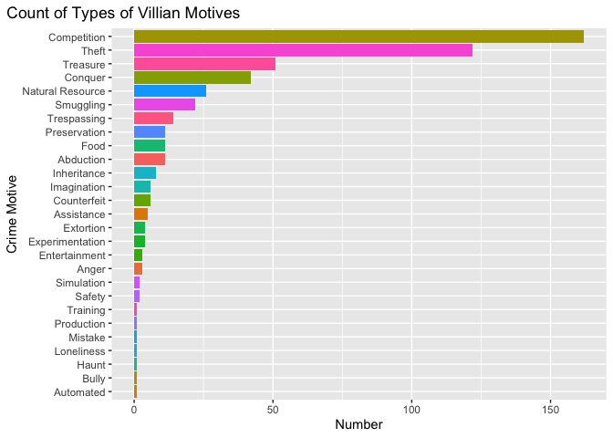<!-- -->

Based on the barplot, the most common reason why a villain would commit
a crime was due to competition. These villains would dress up and
obstruct society so they could ruin the success or chance of success for
another character.

##### Popular Phrases

It is known that with each character comes their own unique catchphrase
that is said in the show. We will track the amounts by:

1)  Use pivot_longer() to take all of the variables of characters saying
    their phrase and place them as values in the dataset. Select the new
    pivoted columns that displayed the phrase said the number of times
    it was said in an episode.

2)  Filter() out the value column to only have phrase that were said
    more than 0 times.

3)  group_by() the dataset by the name and use summarise() to see how
    many times a phrase was said.

4)  filter() out all of the unnecessary phrases and included variables
    that were not necessary for the analysis

5)  Create a plot comparing the number of times a phrase was said.

``` r
# most common phrases plot
scoobydoo |>
  pivot_longer(cols = phrases) |>
  select(name, value) |>
  filter(value > 0) |>
  group_by(name) |>
  summarise(count = sum(value, na.rm = TRUE)) |>
  filter(name != "engagement" & name != "imdb" & name != "number_of_snacks" & name != "split_up" & name != "another_mystery" & name != "set_a_trap") |>
  mutate(phrase = case_when(
    name == "zoinks" ~ '"zoinks"',
    name == "jinkies" ~ '"jinkies"',
    name == "rooby_rooby_roo" ~ '"rooby rooby roo"',
    name == "jeepers" ~ '"jeepers"',
    name == "scooby_doo_where_are_you" ~ '"scooby doo where are you"',
    name == "my_glasses" ~ '"my glasses"',
    name == "groovy" ~ '"groovy"',
    name == "just_about_wrapped_up" ~ '"just about wrapped up"')) |>
  ggplot(aes(x = count,
             y = fct_reorder(phrase, count), fill = phrase)) +
  guides(fill = "none") +
  geom_col() +
  labs(
    title = "Frequency of Common Phrases in Scooby Doo",
    x = "Number of Times Phrase is Said",
    y = "Phrase"
  ) +
  theme_bw() +
  theme(plot.title.position = "plot")
```

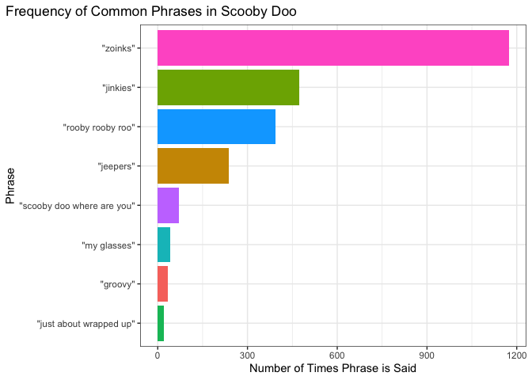<!-- -->

The graph above shows that the phrase “zoinks” is said the most often in
the show followed by “jinkies” and “rooby rooby roo”. “Zoinks” is the
phrase used by Shaggy in excitement or fear. The same can be said for
Velma’s “jinkies”. Finally “rooby rooby roo” is Scooby’s way of
exclaiming his own name except that each first letter of every word in
his name is replaced with an r.

##### Who Caught the Monster

We had previously wrangled the data to convert all the variables that
tracked the actions of specific characters from character classes to
logical classes. These variables were combined and assigned to the name
’people_caught”. Taking this new assigned variable, we then created a
new column in the dataset which identified what character had caught the
monster in the episode. This worked by identifying what character had a
TRUE value in their row for the specific episode and then adding their
name in the column. If more than one character had a TRUE for catching
the monster, then the column identified that more than one character had
caught a monster during that episode To see who had caught the most
monsters:

1)  Use pivot_longer() to take all of the variables of characters
    performing actions and place them as values in the dataset. Select
    the new pivoted columns that displayed the character and the action
    they were performing as well as the value of if the action was TRUE
    or FALSE.

2)  Filter() out the value column to make it that only the TRUE values
    are present. We don’t care if a character did not catch the monster.

3)  group_by() the dataset by the name and use count() to see how many
    times TRUE popped up for each character.

4)  select all of the values that started with ‘caught_X’ and add them
    to a new column where the it just identified their name ‘X’.

5)  Create a plot comparing the number of times each character caught a
    monster.

``` r
# Number of Monsters Each Character Caught Single-handedly
scoobydoo |>
  group_by(monster_catcher) |>
  count() |>
  ggplot(aes(x = n, y = fct_reorder(monster_catcher, n), fill = monster_catcher)) +
  geom_col() +
  guides(fill = "none") +
  labs(title = "Number of Monsters Each Character Caught Single-handedly",
       x = "Number of Monsters Caught", y = "Character") +
  theme(plot.title.position = "plot")
```

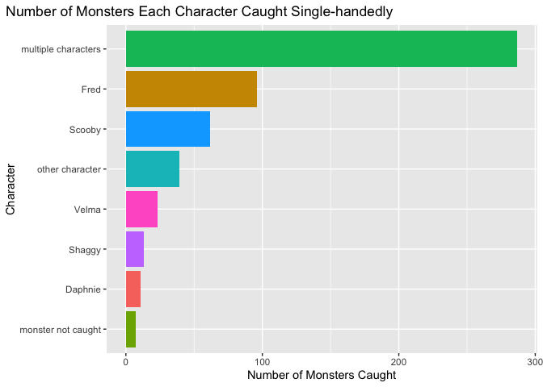<!-- -->

``` r
# Number of Monsters Each Character Caught either single-handedly or with others
scoobydoo |>
  pivot_longer(cols= people_catch) |>
  select(name, value) |>
  filter(value == TRUE) |>
  group_by(name) |>
  count() |>
  filter(str_detect(name, "caught")) |>
  mutate(character = case_when(
    name == "caught_daphnie" ~ "Daphnie",
    name == "caught_fred" ~ "Fred",
    name == "caught_shaggy" ~ "Shaggy",
    name == "caught_scooby" ~ "Scooby",
    name == "caught_velma" ~ "Velma")) |>
  ggplot(aes(x = n, y = fct_reorder(character, n), fill = character)) +
  geom_col() +
  guides(fill = "none") +
  labs(title = "Number of Monsters Each Character Caught",
       subtitle = "including single-handedly and with other characters",
       x = "Number of Monsters Caught", y = "Character") +
  theme(plot.title.position = "plot")
```

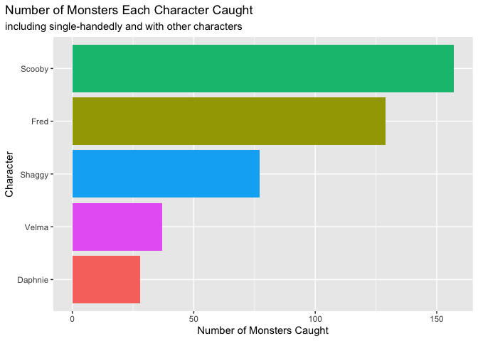<!-- -->

For this portion of the EDA, we chose to create two plots. The first
plot takes into consideration the variable of multiple characters
working together to catch one monster. Fred single-handedly caught the
most monsters. However, when we look at the plot that counts the amount
of catches regardless of if a character worked together or alone, Scooby
caught the most monsters. Considering this, Scooby was probably often
present at times when the group caught a monster. Also it would make
sense to have the mascot of the show be a main contributor to catching
the monster.

##### Voice Actors for Each Character

We also wanted to see how many times each voice actor had acted for
their character. For each column that identified the voice actor we:

1)  group_by() the dataset by the character’s voice actor

2)  count() the number of unique voice actors

3)  plot a barplot.

``` r
#VA Fred
scoobydoo |>
  group_by(fred_va) |>
  count() |>
  mutate(fred_va = na_if(fred_va, "NULL")) |>
  drop_na() |>
  ggplot(aes(x = n, y = fct_reorder(fred_va, n), fill = fred_va)) +
  geom_col() +
  guides(fill = "none") +
  labs(title = "Voice Actor Appearance Count for Fred",
       x = "Number of Appearance", y = "Actor") +
  theme(plot.title.position = "plot")
```

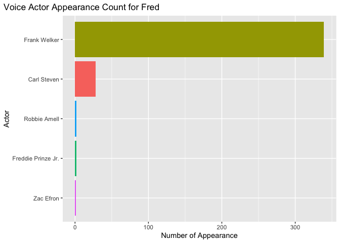<!-- -->

``` r
#VA Daphnie
scoobydoo |>
  group_by(daphnie_va) |>
  count() |>
  mutate(daphnie_va = na_if(daphnie_va, "NULL")) |>
  drop_na() |>
  ggplot(aes(x = n, y = fct_reorder(daphnie_va, n), fill = daphnie_va))+
  geom_col() +
  guides(fill = "none") +
  labs(title = "Voice Actor Appearance Count for Daphnie",
       x = "Number of Appearance", y = "Actor") +
  theme(plot.title.position = "plot")
```

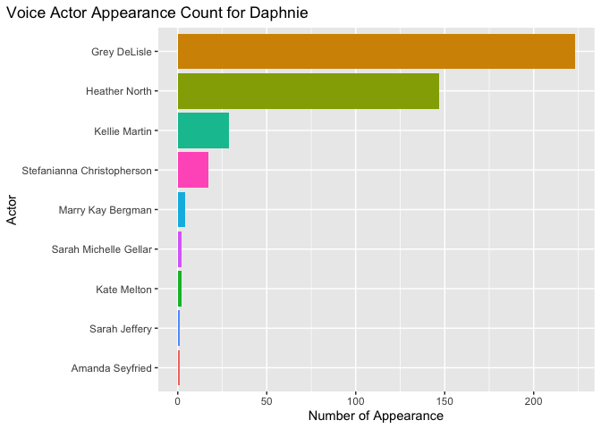<!-- -->

``` r
#VA Velma
scoobydoo |>
  group_by(velma_va) |>
  count() |>
  mutate(velma_va = na_if(velma_va, "NULL")) |>
  drop_na() |>
  ggplot(aes(x = n, y = fct_reorder(velma_va, n), fill = velma_va)) +
  geom_col() +
  guides(fill = "none") +
  labs(title = "Voice Actor Appearance Count for Velma",
       x = "Number of Appearance", y = "Actor") +
  theme(plot.title.position = "plot")
```

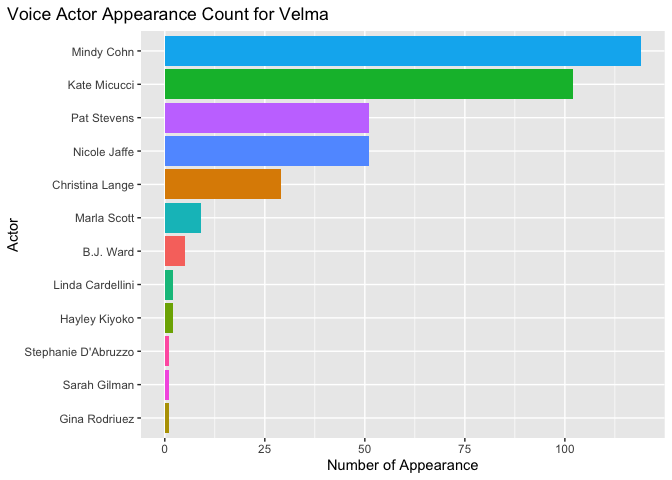<!-- -->

``` r
#VA Shaggy
scoobydoo |>
  group_by(shaggy_va) |>
  count() |>
  mutate(shaggy_va = na_if(shaggy_va, "NULL")) |>
  drop_na() |>
  ggplot(aes(x = n, y = fct_reorder(shaggy_va, n), fill = shaggy_va)) +
  geom_col() +
  guides(fill = "none") +
  labs(title = "Voice Actor Appearance Count for Shaggy",
       x = "Number of Appearance", y = "Actor") +
  theme(plot.title.position = "plot")
```

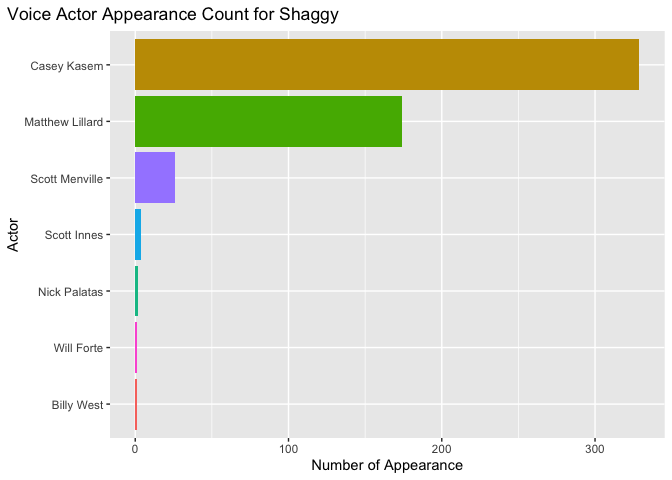<!-- -->

``` r
#VA Scooby
scoobydoo |>
  group_by(scooby_va) |>
  count() |>
  mutate(scooby_va = na_if(scooby_va, "NULL")) |>
  drop_na() |>
  ggplot(aes(x = n, y = fct_reorder(scooby_va, n), fill = scooby_va)) +
  geom_col() +
  guides(fill = "none") +
  labs(title = "Voice Actor Appearance Count for Scooby-Doo",
       x = "Number of Appearance", y = "Actor") +
  theme(plot.title.position = "plot")
```

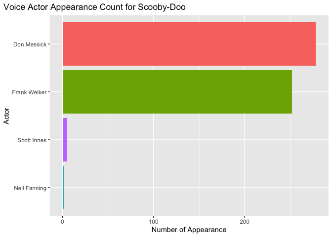<!-- -->
Based on these 5 graphs, here are the voice actors who appeared the most
in the franchise.

1)  Fred = Frank Welker (300+ appearances)

2)  Daphnie = Grey DeLisle (200+ appearances)

3)  Velma = Mindy Cohn (100+ appearances)

4)  Shaggy = Casey Kasem (300+ appearances)

5)  Scooby = Don Messick (200+ appearances)

### Data Analysis

To test which variables held the greatest weight and helped predict a
good IMDB score for a Scooby Doo episode, we utilized a forward
selection stepwise regression. The variables we decided to focus on
were:

-   network
-   engagement
-   format
-   monster_type
-   monster_amount
-   monster_catcher
    -   who caught the monster
-   setting_terrain
-   motive
-   zoinks, jinkies, and rooby_rooby_roo
    -   top 3 iconic phrases, how many times each one was said
-   fred_va, daphnie_va, velma_va, shaggy_va, and scooby_va
    -   who the voice actor was for each character

Starting with the single variable “network” (which had the largest
adjusted R squared value out of all other variables to begin with), we
added each variable to the linear model and kept whichever single
variable increased the adjusted R squared model the most. We continued
this pattern until the variables did not increase the adjusted R squared
value. The starting adjusted R squared value can be seen below.

``` r
rating <-
  linear_reg() |>
  set_engine("lm") |>
  fit(imdb ~ network, data = scoobydoo)
glance(rating)$adj.r.squared
```

    ## [1] 0.5803799

We continued the pattern of adding a single variable and testing each
adjusted R squared value until none of the variables increased the
adjusted R squared value on their own. After some iterations, the final
linear model’s adjusted R squared that we reached can be seen below.

``` r
rating <-
  linear_reg() |>
  set_engine("lm") |>
  fit(imdb ~ network + velma_va + monster_type + motive + engagement + fred_va + zoinks + monster_catcher + monster_amount, data = scoobydoo)
glance(rating)$adj.r.squared
```

    ## [1] 0.7367316

We can tidy the linear regression dataframe to see which variables help
predict a certain increase/descrease in IMDB score as well. The
variables that hold weight in predicting an IMDB score are:

-   network
-   the voice actor for velma
-   the type of monster
-   motive for crime
-   how many people engaged with the IMDB episode website
-   the voice actor for fred
-   how many times “zoinks” was said
-   who caught the monster
-   how many monsters were in the episode

``` r
tidy(rating)
```

    ## # A tibble: 198 × 5
    ##    term                        estimate std.error statistic  p.value
    ##    <chr>                          <dbl>     <dbl>     <dbl>    <dbl>
    ##  1 (Intercept)                    7.12      0.865     8.23  3.86e-15
    ##  2 networkBoomerang               0.835     0.422     1.98  4.87e- 2
    ##  3 networkCartoon Network         0.924     0.414     2.23  2.64e- 2
    ##  4 networkCBS                     0.511     0.611     0.836 4.04e- 1
    ##  5 networkThe CW                 -1.24      0.576    -2.16  3.14e- 2
    ##  6 networkThe WB                  0.187     0.402     0.465 6.42e- 1
    ##  7 networkWarner Bros. Picture    6.98      7.29      0.958 3.38e- 1
    ##  8 networkWarner Home Video      -0.247     0.428    -0.576 5.65e- 1
    ##  9 velma_vaChristina Lange       -0.451     0.725    -0.622 5.35e- 1
    ## 10 velma_vaGina Rodriuez         -6.92      6.03     -1.15  2.53e- 1
    ## # … with 188 more rows

There are a lot of rows with different instances and predictors because
there are a lot of categorical variables with different options. To sum
it up, according to the model, the factors that would indicate a higher
IMDB score would be:

-   The network was Warner Bros. Pictures
-   The voice actor for Velma was Pat Stevens
-   The monster types included one ghost, three undead, and three
    animals
-   The motive for crime dealt with inheritance
-   The lower the engagement (number of people), the higher the IMDB
    score
-   The voice actor for Fred was Carl Steven
-   The more times “zoinks” was said, the higher the IMDB score
-   The person who caught the monster was someone other than the five
    main characters

### Results

Of all the models we tested in our forward selection, our analysis
showed that the best model was for predicting IMDB rating included the
predictor variables: network, Velma’s voice actor, monster type, motive,
engagement, Fred’s voice actor, the amount of times “zoinks” was said,
and who caught the monster. As the list of predictor variables goes down
the list, the weight and effect that each one has on the predicted IMDB
score lessens as well.

Looking at the top five most highly rated episodes in the tibble below,
we see that our model was wrong on all counts of the expected network,
Velma’s voice actor, monster type, motive, engagement level, Fred’s
voice actor, number of times “zoinks” was said, and character who caught
the monster.

``` r
imdb_order <- order(scoobydoo$imdb, decreasing=TRUE)
scoobydoo[imdb_order,] |> 
  select(imdb, network, velma_va, monster_type, motive, engagement, fred_va, zoinks, monster_catcher) |>
  slice(1:5)
```

    ## # A tibble: 5 × 9
    ##    imdb network         velma_va   monster_type motive engagement fred_va zoinks
    ##   <dbl> <chr>           <chr>      <chr>        <chr>       <dbl> <chr>    <dbl>
    ## 1   9.3 Cartoon Network Mindy Cohn Mythical,An… Conqu…        260 Frank …      2
    ## 2   9.2 Cartoon Network Mindy Cohn Ancient      Theft         272 Frank …      1
    ## 3   9.1 Cartoon Network Mindy Cohn Mythical     Compe…        202 Frank …      0
    ## 4   9   Cartoon Network Mindy Cohn Mythical     Conqu…        184 Frank …      2
    ## 5   8.9 Cartoon Network Mindy Cohn Mythical     Theft         207 Frank …      0
    ## # … with 1 more variable: monster_catcher <chr>

## Conclusion

We began this case study by asking which combination of predictor
variables in a linear model best predicts the IMDB score for a given
Scooby Doo episode/movie. To help answer this question, we explored a
variety of variables relevant to the Scooby Doo franchise through
various plots in our exploratory data analysis. We then used forward
selection to build a linear model with the highest adjusted r squared
value. Our final model for predicting IMDB rating takes into account the
variables: network, Velma’s voice actor, monster type, crime motive,
IMDB engagement, Fred’s voice actor, the number of times “zoinks” was
said, which character caught the monster, and the number of monsters in
the episode/movie. It was interesting to see that the three top
influences on the predicted IMDB score were the network (this had the
largest prediction weight), the type of monster, and the voice actor for
Velma. Unfortunately, our model did not seem to be very accurate when
compared to the top five highest rated episodes in the dataset.

Although we picked many different variables from the original dataset
that we thought were most likely to influence the IMDB rating, there
were still many variables we did not analyze that likely contributed
greatly to the IMDB rating which would explain why our model failed to
correctly predict the variable values of the variables included our
model for the top 5 most highly rated episodes in the dataset. Also, our
case study could be improved by comparing linear models to non-linear
models for predicting IMDB score. In a future case study, we would want
to look into findings from this case such as how each network handled
their episodes of Scooby Doo, how the typical audience perceived the
monsters/villains, and how different factors of the voice actor for
Velma might have influenced audience perception of the show. We could
also look into the factors and situations of the other variables as
well, although those had less effect on the predicted IMDB score.

[^1]: <https://en.wikipedia.org/wiki/Scooby-Doo>

[^2]: <https://scoobydoo.fandom.com/wiki/Category:Films>

[^3]: <https://github.com/rfordatascience/tidytuesday/blob/master/data/2021/2021-07-13/readme.md>
